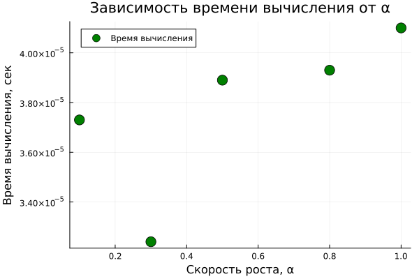

---
## Author
author:
  name: Соловьев Богдан Михайлович
  degrees: student
  orcid: 
  email:
  affiliation:
    - name: Российский университет дружбы народов
      country: Российская Федерация
      postal-code: 117198
      city: Москва
      address: ул. Миклухо-Маклая, д. 6
## Title
title: Структура научной презентации
subtitle: Простейший вариант
license: CC BY
date: today
date-format: "YYYY-MM-DD"
---

# Информация

## Вводная часть

# Экспоненциальный рост

**Цель:** Исследовать решение уравнения $\frac{du}{dt} = \alpha u$.

## Время вычислений

##

Разброс значений очень небольшой. 
Это означает, что в исследуемом диапазоне изменение параметра $\alpha$ 
практически не влияет на вычислительную производительность выбранного численного метода.

## Время удвоения

##

Из графика видно, что при увеличении скорости роста $\alpha$ время, 
необходимое для удвоения значения $u(t)$, уменьшается. 
Например, при $\alpha = 0.1$ время удвоения составляет примерно $6.93$,
тогда как при $\alpha = 1.0$ оно уменьшается до примерно $0.69$.

## Сравнение параметров

##

График демонстрирует характерную для экспоненциального роста зависимость. 
При малом значении $\alpha = 0.1$ функция увеличивается относительно
медленно и к моменту $t = 10$ достигает значения порядка $e \approx 2.72$.

## Итоговый слайд

Проведённое параметрическое исследование показывает, 
что коэффициент $\alpha$ является определяющим параметром экспоненциальной модели. 
При увеличении $\alpha$ скорость роста функции $u(t)$ значительно увеличивается, 
а время удвоения уменьшается в соответствии с теоретической зависимостью $t_2 = \ln(2) / \alpha$. 
Численные результаты практически совпадают с теоретическими,
что подтверждает корректность реализации модели и выбранного численного метода Tsit5.