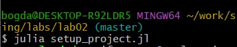
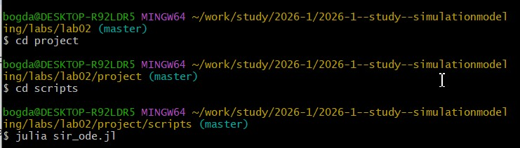
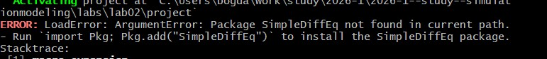
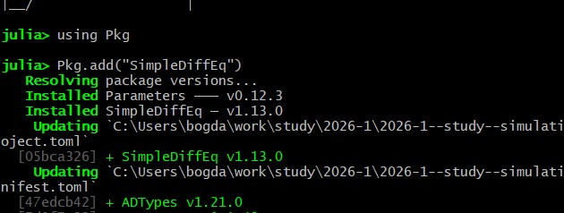
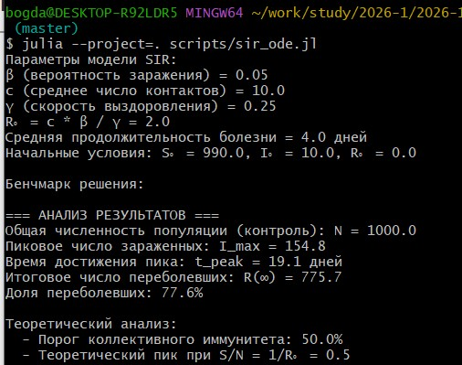
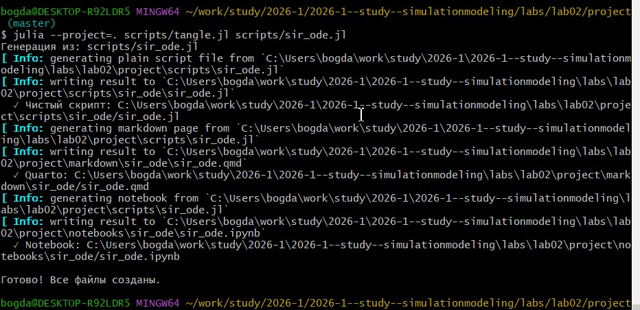
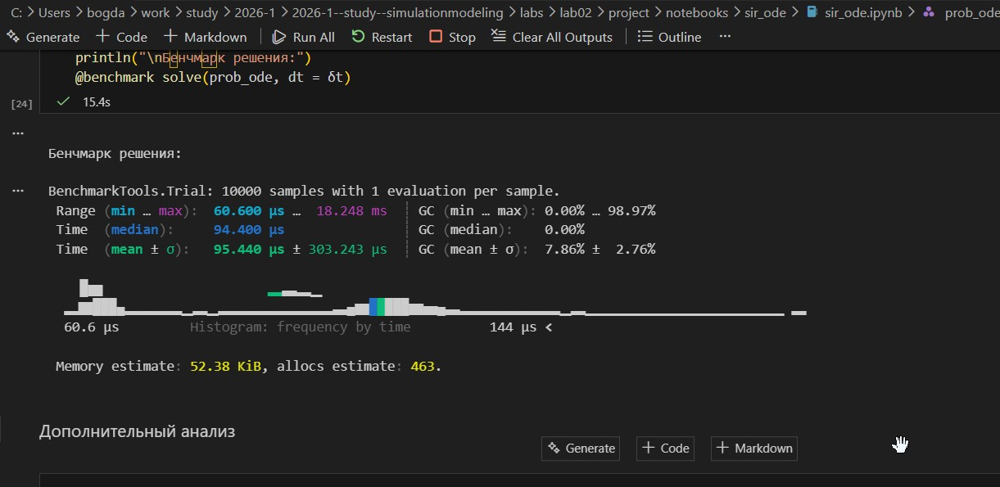
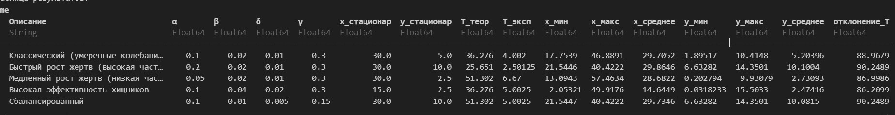

---
## Author
author:
  name: Дмитрий Сергеевич Кулябов
  degrees: DSc
  orcid: 0000-0002-0877-7063
  email: kulyabov-ds@rudn.ru
  affiliation:
    - name: Российский университет дружбы народов
      country: Российская Федерация
      postal-code: 117198
      city: Москва
      address: ул. Миклухо-Маклая, д. 6

## Title
title: "Шаблон отчёта по лабораторной работе"
subtitle: "Простейший вариант"
license: "CC BY"
---

```{julia}
# Универсальная инициализация для отчёта
include("../project/setup_report.jl")

# Подключаем нужные пакеты
using DifferentialEquations
using SimpleDiffEq
using Tables
using DataFrames
using StatsPlots
using LaTeXStrings
using Plots
using BenchmarkTools
using CSV

function sir_ode!(du, u, p, t)
    (S, I, R) = u
    (β, c, γ) = p
    N = S + I + R
    @inbounds begin
        du[1] = -β * c * I / N * S
        du[2] = β * c * I / N * S - γ * I
        du[3] = γ * I
    end
    nothing
end

println("SIR функция загружена")
```

# Цель работы

Исследовать модели основных методов эпидемиологии на примере SIR и LV. Также научиться переводить код в литературный вид и получить опыт
пользования языком julia

# Задание

Создать рабочий каталог для кода.
Установить необходимые пакеты.
Выполнить предложенный код.
Преобразовать код в литературный стиль.
Сгенерировать из литературного кода:
чистый код;
jupyter notebook;
документацию в формате Quarto.
Выполнить код из jupyter notebook.
Интегрировать документацию в формате Quarto в отчёт.
Добавить в код в литературном стиле вычисление для набора параметров.
Сгенерировать из литературного кода с параметрами:
чистый код;
jupyter notebook;
документацию в формате Quarto.
Выполнить код из jupyter notebook с параметрами.
Интегрировать документацию с параметрами в формате Quarto в отчёт.

# Теоретическое введение

Модель SIR делит всю популяцию на три взаимосвязанные группы (компартменты), что отражено в её названии:

 S — Susceptible (Восприимчивые): люди, которые не болели, не имеют иммунитета и могут заразиться.

 I — Infectious (Инфицированные/Заразные): люди, которые в данный момент больны и могут передавать инфекцию.

 R — Recovered (Выздоровевшие/Удаленные): люди, которые переболели и приобрели иммунитет (или умерли). Они больше не участвуют в процессе передачи.

Основная цель модели: не предсказать судьбу конкретного человека, а понять общую динамику эпидемии — будет ли она разрастаться, как быстро, сколько людей в итоге переболеет, как влияют карантинные меры.


Модель Лотки-Вольтерры — это фундаментальная математическая модель в экологии, описывающая динамику взаимодействия двух видов: хищников и жертв. Она была независимо предложена в 1920-х годах:

Альфредом Лоткой (1925) для химических реакций [3,4].

Витторио Вольтеррой (1926) для объяснения колебаний улова рыбы в Адриатическом море [5,6].

Модель демонстрирует, как даже простая система взаимодействий может порождать сложные колебательные режимы, объясняя циклические изменения численности в природных экосистемах.

# Выполнение лабораторной работы

## Модель SIR

Создаю пространство для выполнения лабораторной. Для этого создаю файл setup_report([рис. @fig-001]).
:
```julia
#!/usr/bin/env julia
# setup_project.jl

using Pkg
Pkg.add("DrWatson")
using DrWatson

project_name = "project"
initialize_project(project_name; authors="Bogdan", git=false)

println("✅ Проект создан: ", project_name)
println("📁 Перейдите в директорию: cd ", project_name)
```

{#fig-001 width=70%}

Выполняю setup_project.jl([рис. @fig-001]).

{#fig-002 width=70%}

Перехожу в создавшуюся папку скриптс, куда создаю ноовый скрипт и вы полняю его([рис. @fig-003]):

{#fig-003 width=70%}

сам код:
```julia
using DrWatson
@quickactivate "project"


using DifferentialEquations
using SimpleDiffEq
using Tables
using DataFrames
using StatsPlots
using LaTeXStrings  # Для красивого отображения формул на графиках
using Plots
using BenchmarkTools

script_name = splitext(basename(PROGRAM_FILE))[1]
mkpath(plotsdir(script_name))
mkpath(datadir(script_name))

# ## Модель Лотки–Вольтерры

function sir_ode!(du, u, p, t)
    (S, I, R) = u
    (β, c, γ) = p
    N = S + I + R
    @inbounds begin
        du[1] = -β * c * I / N * S
        du[2] = β * c * I / N * S - γ * I
        du[3] = γ * I
    end
    nothing
end

# Параметры модели
δt = 0.1
tmax = 40.0
tspan = (0.0, tmax)
u0 = [990.0, 10.0, 0.0]  # S, I, R
p = [0.05, 10.0, 0.25]   # β, c, γ

# Расчет базового репродуктивного числа
R0 = (p[2] * p[1]) / p[3]  # R₀ = (c * β) / γ

# Создание и решение задачи
prob_ode = ODEProblem(sir_ode!, u0, tspan, p)
sol_ode = solve(prob_ode, dt = δt)

# Подготовка данных в DataFrame
df_ode = DataFrame(Tables.table(sol_ode'))
rename!(df_ode, ["S", "I", "R"])
df_ode[!, :t] = sol_ode.t
df_ode[!, :N] = df_ode.S + df_ode.I + df_ode.R  # Общая численность популяции

# Вывод параметров модели
println("Параметры модели SIR:")
println("β (вероятность заражения) = ", p[1])
println("c (среднее число контактов) = ", p[2])
println("γ (скорость выздоровления) = ", p[3])
println("R₀ = c * β / γ = ", round(R0, digits=3))
println("Средняя продолжительность болезни = ", round(1/p[3], digits=2), " дней")
println("Начальные условия: S₀ = ", u0[1], ", I₀ = ", u0[2], ", R₀ = ", u0[3])

# 1. ОСНОВНОЙ ГРАФИК: динамика всех трех групп
plt1 = @df df_ode plot(:t,
    [:S :I :R],
    label=[L"S(t)" L"I(t)" L"R(t)"],
    xlabel="Время, дни",
    ylabel="Количество людей",
    title="Модель SIR: Динамика эпидемии",
    linewidth=2,
    legend=:right,
    grid=true,
    size=(800, 500))

# Добавление аннотаций с параметрами
annotate!(plt1, maximum(df_ode.t) * 0.7, maximum(df_ode.N) * 0.8,
    text("Параметры:\nβ = $(p[1])\nc = $(p[2])\nγ = $(p[3])\nR₀ = $(round(R0, digits=2))",
    8, :left))

# График только инфицированных (I)
plt2 = @df df_ode plot(:t, :I,
    label=L"I(t)",
    xlabel="Время, дни",
    ylabel="Количество инфицированных",
    title="Динамика числа зараженных",
    color=:red,
    linewidth=2,
    fill=(0, 0.3, :red),
    grid=true,
    size=(800, 400))

# Отметка пика эпидемии
peak_idx = argmax(df_ode.I)
peak_time = df_ode.t[peak_idx]
peak_value = df_ode.I[peak_idx]
vline!(plt2, [peak_time], color=:black, linestyle=:dash, label=false, linewidth=1)
annotate!(plt2, peak_time, peak_value * 1.05,
    text("Пик: $(round(peak_value, digits=1)) на $(round(peak_time, digits=1)) день",
    8, :top))

# График в логарифмическом масштабе (для анализа экспоненциального роста)
plt3 = @df df_ode plot(:t, :I,
    label=L"I(t)",
    xlabel="Время, дни",
    ylabel="Количество инфицированных (лог. масштаб)",
    title="Экспоненциальный рост (лог. шкала)",
    yscale=:log10,
    color=:red,
    linewidth=2,
    grid=true,
    size=(800, 400))

# График долей населения (в процентах)
plt4 = @df df_ode plot(:t,
    [:S :I :R] ./ df_ode.N .* 100,
    label=[L"S(t)/N" L"I(t)/N" L"R(t)/N"],
    xlabel="Время, дни",
    ylabel="Доля популяции, %",
    title="Динамика эпидемии (в процентах)",
    linewidth=2,
    legend=:right,
    grid=true,
    size=(800, 500))

# Горизонтальная линия для порога коллективного иммунитета
if R0 > 1
    herd_immunity_threshold = (1 - 1/R0) * 100
    hline!(plt4, [herd_immunity_threshold], color=:purple, linestyle=:dash,
        label="Порог коллективного иммунитета ($(round(herd_immunity_threshold, digits=1))%)",
        linewidth=1.5)
end

# Фазовый портрет (I vs S)
plt5 = plot(df_ode.S, df_ode.I,
    label="Фазовая траектория",
    xlabel=L"S(t)",
    ylabel=L"I(t)",
    title="Фазовый портрет SIR модели",
    color=:blue,
    linewidth=2,
    grid=true,
    size=(800, 500),
    legend=:topright)

# Добавление стрелок направления
for i in 1:50:length(df_ode.S)-1
    plot!(plt5, [df_ode.S[i], df_ode.S[i+1]], [df_ode.I[i], df_ode.I[i+1]],
        arrow=:closed, color=:blue, alpha=0.5, label=false)
end

# График Rₑ - эффективного репродуктивного числа
df_ode[!, :Re] = R0 .* df_ode.S ./ df_ode.N
plt6 = @df df_ode plot(:t, :Re,
    label=L"R_e(t)",
    xlabel="Время, дни",
    ylabel=L"R_e",
    title="Динамика эффективного репродуктивного числа",
    color=:green,
    linewidth=2,
    grid=true,
    size=(800, 400))

# Горизонтальная линия на уровне 1
hline!(plt6, [1.0], color=:red, linestyle=:dash, label="Порог эпидемии (Rₑ=1)", linewidth=1.5)

# Отметка момента, когда Rₑ становится < 1
cross_idx = findfirst(x -> x < 1, df_ode.Re)
if !isnothing(cross_idx) && cross_idx > 1
    cross_time = df_ode.t[cross_idx]
    vline!(plt6, [cross_time], color=:black, linestyle=:dash, label=false, linewidth=1)
    annotate!(plt6, cross_time, 1.2,
        text("Rₑ<1 с $(round(cross_time, digits=1)) дня", 8, :left))
end

# Компактный график всех кривых в одной панели
plt7 = plot(layout=(2, 3), size=(1200, 800))

# Верхний ряд
plot!(plt7[1], df_ode.t, df_ode.S, label=L"S(t)", color=1, linewidth=2, title="Восприимчивые")
plot!(plt7[2], df_ode.t, df_ode.I, label=L"I(t)", color=2, linewidth=2, title="Зараженные")
plot!(plt7[3], df_ode.t, df_ode.R, label=L"R(t)", color=3, linewidth=2, title="Выздоровевшие")

# Нижний ряд
plot!(plt7[4], df_ode.t, df_ode.I, label=L"I(t)", color=2, linewidth=2,
    yscale=:log10, title="Лог. масштаб")
plot!(plt7[5], df_ode.S, df_ode.I, label=false, color=4, linewidth=2,
    title="Фазовый портрет", xlabel=L"S", ylabel=L"I")
plot!(plt7[6], df_ode.t, df_ode.Re, label=L"R_e", color=:green, linewidth=2,
    title=L"R_e(t)", hline=[1.0], linestyle=:dash, linecolor=:red)

# Сохранение графиков

savefig(plt1, plotsdir(script_name, "sir_main.png"))
savefig(plt2, plotsdir(script_name, "sir_infected.png"))
savefig(plt3, plotsdir(script_name, "sir_log_scale.png"))
savefig(plt4, plotsdir(script_name, "sir_percentages.png"))
savefig(plt5, plotsdir(script_name, "sir_phase_portrait.png"))
savefig(plt6, plotsdir(script_name, "sir_effective_R.png"))
savefig(plt7, plotsdir(script_name, "sir_panel.png"))

# Бенчмарк для оценки производительности
println("\nБенчмарк решения:")
@benchmark solve(prob_ode, dt = δt)

# Дополнительный анализ
println("\n=== АНАЛИЗ РЕЗУЛЬТАТОВ ===")
println("Общая численность популяции (контроль): N = ", round(df_ode.N[1], digits=1))
println("Пиковое число зараженных: I_max = ", round(peak_value, digits=1))
println("Время достижения пика: t_peak = ", round(peak_time, digits=1), " дней")
println("Итоговое число переболевших: R(∞) = ", round(df_ode.R[end], digits=1))
println("Доля переболевших: ", round(df_ode.R[end]/df_ode.N[1]*100, digits=1), "%")

if R0 > 1
    println("\nТеоретический анализ:")
    println("  - Порог коллективного иммунитета: ", round((1-1/R0)*100, digits=1), "%")
    println("  - Теоретический пик при S/N = 1/R₀ = ", round(1/R0, digits=3))
end
```

Не хватает библиотеки с дифференциальными уравнениями([рис. @fig-004])

{#fig-004 width=70%}

Докачиваю необходимую библиотеку. (на самом деле ещё пару библиотек пришлось установить)([рис. @fig-005])

{#fig-005 width=70%}

Выполняю скрипт - всё рабоатет ([рис. @fig-006])

{#fig-006 width=70%}

Создаю остальные производные форматы ([рис. @fig-007])

{#fig-007 width=70%}

Запускаю notebook ([рис. @fig-008])

{#fig-008 width=70%}



# Модель Лотки–Вольтерры

Все действия повторяю для нового скрипта lv_ode.jl.

Сам файл, описанный в литературном стиле:
```julia
using DrWatson
quickactivate(dirname(@__DIR__), "project")

using DifferentialEquations
using DataFrames
using StatsPlots
using LaTeXStrings
using Plots
using Statistics
using FFTW
using LinearAlgebra
using CSV

script_name = splitext(basename(PROGRAM_FILE))[1]
mkpath(plotsdir(script_name))
mkpath(datadir(script_name))


# ## МОДЕЛЬ ЛОТКИ-ВОЛЬТЕРРЫ (ХИЩНИК-ЖЕРТВА)

"""
Модель Лотки-Вольтерры (хищник-жертва)

Данная модель описывает динамику взаимодействия двух видов:
  - Жертвы (x) — популяция, служащая пищей для хищников
  - Хищники (y) — популяция, питающаяся жертвами

Система дифференциальных уравнений:
  dx/dt = α·x - β·x·y    (1)  — рост жертв ограничен хищниками
  dy/dt = δ·x·y - γ·y    (2)  — рост хищников зависит от наличия жертв

Физический смысл параметров:
  α [время⁻¹] — коэффициент естественного прироста жертв
                (рождаемость минус естественная смертность)
  β [особь⁻¹·время⁻¹] — коэффициент эффективности охоты хищников
                (вероятность встречи и поедания)
  δ [особь⁻¹·время⁻¹] — коэффициент конверсии биомассы
                (сколько хищников может прокормить одна жертва)
  γ [время⁻¹] — коэффициент естественной смертности хищников

Историческая справка:
  Модель была независимо предложена Альфредом Лоткой (1925) и
  Вито Вольтеррой (1926). Вольтерра использовал её для объяснения
  колебаний уловов рыб в Адриатическом море после Первой мировой войны.
"""
function lotka_volterra!(du, u, p, t)
    x, y = u               # x - жертвы, y - хищники
    α, β, δ, γ = p          # параметры модели

    @inbounds begin
        du[1] = α*x - β*x*y      # dx/dt: изменение популяции жертв
        du[2] = δ*x*y - γ*y      # dy/dt: изменение популяции хищников
    end
    nothing
end


# ## АНАЛИТИЧЕСКИЕ СВОЙСТВА МОДЕЛИ

"""
Анализ стационарных точек модели Лотки-Вольтерры

Система имеет две стационарные точки:

1. Тривиальная точка: (x, y) = (0, 0)
   — соответствует вымиранию обоих видов.
   Матрица Якоби: J = [α  0; 0 -γ]
   Собственные числа: λ₁ = α (>0), λ₂ = -γ (<0)
   → седловая точка (неустойчива)

2. Нетривиальная точка: (x*, y*) = (γ/δ, α/β)
   — точка сосуществования видов.
   Матрица Якоби: J = [0  -βx*; δy*  0]
   Собственные числа: чисто мнимые
   → центр (устойчивые колебания)

В окрестности нетривиальной стационарной точки решение имеет вид:
  x(t) ≈ x* + A·cos(ωt + φ)
  y(t) ≈ y* + B·sin(ωt + φ)

Где частота колебаний: ω = √(αγ)
Период колебаний: T = 2π/√(αγ)
"""
function analyze_fixed_points(p)
    α, β, δ, γ = p

    # Стационарная точка сосуществования
    x_star = γ / δ
    y_star = α / β

    # Частота и период колебаний
    ω = sqrt(α * γ)
    T = 2π / ω

    # Проверка устойчивости (линеаризация)
    J = [0  -β*x_star; δ*y_star  0]
    eigenvalues = eigvals(J)

    return (;
        x_star = x_star,
        y_star = y_star,
        frequency = ω,
        period = T,
        eigenvalues = eigenvalues,
        is_stable = all(real(eigenvalues) .<= 0)
    )
end


# ## НАБОРЫ ПАРАМЕТРОВ ДЛЯ ВЫЧИСЛЕНИЙ

"""
Наборы параметров модели Лотки-Вольтерры

Каждый набор соответствует различным экологическим сценариям:
  1. Классический сценарий — базовые параметры из учебников
  2. Быстрый сценарий — высокая скорость размножения жертв
  3. Медленный сценарий — низкая скорость размножения жертв
"""
parameter_sets = [
    # [α, β, δ, γ]
    [0.1, 0.02, 0.01, 0.3],    # Набор 1: Классический (умеренные колебания)
    [0.2, 0.02, 0.01, 0.3],    # Набор 2: Быстрый рост жертв (высокая частота)
    [0.05, 0.02, 0.01, 0.3],   # Набор 3: Медленный рост жертв (низкая частота)
    [0.1, 0.04, 0.02, 0.3],    # Набор 4: Высокая эффективность хищников
    [0.1, 0.01, 0.005, 0.15]   # Набор 5: Сбалансированный (устойчивые колебания)
]

parameter_names = [
    "Классический (умеренные колебания)",
    "Быстрый рост жертв (высокая частота)",
    "Медленный рост жертв (низкая частота)",
    "Высокая эффективность хищников",
    "Сбалансированный"
]

# Начальные условия (одинаковые для всех экспериментов)
u0_lv = [40.0, 9.0]  # [жертвы, хищники]

# Временные параметры
tspan_lv = (0.0, 200.0)   # длительность симуляции
dt_lv = 0.01              # шаг интегрирования


# ## ФУНКЦИЯ ДЛЯ РЕШЕНИЯ МОДЕЛИ С ЗАДАННЫМИ ПАРАМЕТРАМИ

"""
    solve_lotka_volterra(p, u0, tspan; kwargs...)

Решает систему Лотки-Вольтерры с заданными параметрами.

Аргументы:
  p — вектор параметров [α, β, δ, γ]
  u0 — начальные условия [x0, y0]
  tspan — интервал времени (t_start, t_end)

Возвращает структуру с решением и проанализированными данными.
"""
function solve_lotka_volterra(p, u0, tspan; saveat=0.1, reltol=1e-8, abstol=1e-10)
    # Создание и решение задачи
    prob = ODEProblem(lotka_volterra!, u0, tspan, p)
    sol = solve(prob,
                Tsit5(),
                dt = dt_lv,
                reltol = reltol,
                abstol = abstol,
                saveat = saveat,
                dense = true)

    # Подготовка данных
    df = DataFrame()
    df[!, :t] = sol.t
    df[!, :prey] = [u[1] for u in sol.u]
    df[!, :predator] = [u[2] for u in sol.u]

    # Расчет производных
    α, β, δ, γ = p
    df[!, :dprey_dt] = α .* df.prey .- β .* df.prey .* df.predator
    df[!, :dpredator_dt] = δ .* df.prey .* df.predator .- γ .* df.predator

    # Относительные изменения
    df[!, :prey_rel_change] = df.dprey_dt ./ df.prey .* 100
    df[!, :predator_rel_change] = df.dpredator_dt ./ df.predator .* 100

    return (sol = sol, df = df)
end


# ## АНАЛИЗ РЕЗУЛЬТАТОВ ДЛЯ ВСЕХ НАБОРОВ ПАРАМЕТРОВ

println("\n" * "="^80)
println(" " * "МОДЕЛЬ ЛОТКИ-ВОЛЬТЕРРЫ: АНАЛИЗ НАБОРОВ ПАРАМЕТРОВ")
println("="^80)

# Хранение результатов всех экспериментов
results = []

for (idx, p) in enumerate(parameter_sets)
    α, β, δ, γ = p

    println("\n" * "-"^60)
    println("ЭКСПЕРИМЕНТ #$idx: $(parameter_names[idx])")
    println("-"^60)

    # Аналитический анализ стационарных точек
    fp_analysis = analyze_fixed_points(p)
    println("\n📊 Аналитический анализ:")
    println("  Стационарная точка: (x*, y*) = (",
            round(fp_analysis.x_star, digits=2), ", ",
            round(fp_analysis.y_star, digits=2), ")")
    println("  Теоретическая частота колебаний: ω = ", round(fp_analysis.frequency, digits=4))
    println("  Теоретический период: T = ", round(fp_analysis.period, digits=2))

    # Численное решение
    println("\n🔬 Численное моделирование:")

    @time begin
        result = solve_lotka_volterra(p, u0_lv, tspan_lv)
        sol, df = result.sol, result.df
    end

    # Статистический анализ
    prey_min = minimum(df.prey)
    prey_max = maximum(df.prey)
    prey_mean = mean(df.prey)
    predator_min = minimum(df.predator)
    predator_max = maximum(df.predator)
    predator_mean = mean(df.predator)

    println("\n📈 Статистика популяций:")
    println("  Жертвы: min = ", round(prey_min, digits=2),
            ", max = ", round(prey_max, digits=2),
            ", среднее = ", round(prey_mean, digits=2))
    println("  Хищники: min = ", round(predator_min, digits=2),
            ", max = ", round(predator_max, digits=2),
            ", среднее = ", round(predator_mean, digits=2))

    # Спектральный анализ (нахождение доминирующей частоты)
    function find_dominant_frequency(signal, dt)
        n = length(signal)
        spectrum = abs.(rfft(signal .- mean(signal)))
        freq = rfftfreq(n, 1/dt)

        # Ищем максимум, исключая нулевую частоту
        idx_max = argmax(spectrum[2:end]) + 1
        return freq[idx_max], spectrum[idx_max]
    end

    dom_freq_prey, _ = find_dominant_frequency(df.prey, dt_lv)
    dom_freq_pred, _ = find_dominant_frequency(df.predator, dt_lv)

    println("\n🎵 Спектральный анализ:")
    println("  Доминирующая частота (жертвы): ", round(dom_freq_prey, digits=4))
    println("  Экспериментальный период (жертвы): ", round(1/dom_freq_prey, digits=2))
    println("  Доминирующая частота (хищники): ", round(dom_freq_pred, digits=4))
    println("  Экспериментальный период (хищники): ", round(1/dom_freq_pred, digits=2))

    # Проверка соответствия теории
    period_error = abs(1/dom_freq_prey - fp_analysis.period) / fp_analysis.period * 100
    println("\n🎯 Соответствие теории:")
    println("  Отклонение периода от теоретического: ", round(period_error, digits=2), "%")

    # Сохранение результатов
    push!(results, (;
        params = p,
        name = parameter_names[idx],
        df = df,
        sol = sol,
        stats = (min_prey=prey_min, max_prey=prey_max, mean_prey=prey_mean,
                 min_pred=predator_min, max_pred=predator_max, mean_pred=predator_mean),
        fp = fp_analysis,
        dom_freq = (prey=dom_freq_prey, predator=dom_freq_pred)
    ))

    # Построение графика для текущего набора параметров
    plt = plot(df.t, [df.prey df.predator],
               label=[L"Жертвы (x)" L"Хищники (y)"],
               xlabel="Время", ylabel="Популяция",
               title="Лотка-Вольтерра: $(parameter_names[idx])",
               linewidth=2,
               legend=:topright,
               size=(900, 400))

    hline!(plt, [fp_analysis.x_star], color=:green, linestyle=:dash, label="x* (теор.)")
    hline!(plt, [fp_analysis.y_star], color=:red, linestyle=:dash, label="y* (теор.)")

    savefig(plt, plotsdir(script_name, "lv_set$(idx)_dynamics.png"))
end

# ## СРАВНИТЕЛЬНЫЙ АНАЛИЗ ВСЕХ НАБОРОВ ПАРАМЕТРОВ

println("\n" * "="^80)
println(" " * "СРАВНИТЕЛЬНЫЙ АНАЛИЗ НАБОРОВ ПАРАМЕТРОВ")
println("="^80)

# Создаем сводную таблицу
comparison_df = DataFrame(
    Набор = Int[],
    Описание = String[],
    α = Float64[],
    β = Float64[],
    δ = Float64[],
    γ = Float64[],
    x_стационар = Float64[],
    y_стационар = Float64[],
    T_теор = Float64[],
    T_эксп = Float64[],
    x_мин = Float64[],
    x_макс = Float64[],
    x_среднее = Float64[],
    y_мин = Float64[],
    y_макс = Float64[],
    y_среднее = Float64[],
    отклонение_T = Float64[]
)

for (idx, r) in enumerate(results)
    push!(comparison_df, [
        idx,
        r.name,
        r.params[1],
        r.params[2],
        r.params[3],
        r.params[4],
        r.fp.x_star,
        r.fp.y_star,
        r.fp.period,
        1/r.dom_freq.prey,
        r.stats.min_prey,
        r.stats.max_prey,
        r.stats.mean_prey,
        r.stats.min_pred,
        r.stats.max_pred,
        r.stats.mean_pred,
        abs(1/r.dom_freq.prey - r.fp.period) / r.fp.period * 100
    ])
end

println("\n📋 Сводная таблица результатов:")
println(comparison_df)

# Сохранение сводной таблицы
CSV.write(datadir(script_name, "comparison_results.csv"), comparison_df)


# ## ВИЗУАЛИЗАЦИЯ СРАВНЕНИЯ ВСЕХ НАБОРОВ

# График 1: Сравнение периодов колебаний
plt_periods = bar(1:length(results),
                  [r.fp.period for r in results],
                  label="Теоретический период",
                  fillalpha=0.5,
                  xlabel="Номер набора параметров",
                  ylabel="Период колебаний",
                  title="Сравнение периодов колебаний")

bar!(plt_periods, 1:length(results),
     [1/r.dom_freq.prey for r in results],
     label="Экспериментальный период (жертвы)",
     fillalpha=0.5)

savefig(plt_periods, plotsdir(script_name, "comparison_periods.png"))

# График 2: Сравнение стационарных точек
x_stars = [r.fp.x_star for r in results]
y_stars = [r.fp.y_star for r in results]

plt_fixed = scatter(x_stars, y_stars,
                    label="Стационарные точки",
                    xlabel=L"x* (стационар жертв)",
                    ylabel=L"y* (стационар хищников)",
                    title="Стационарные точки для разных наборов параметров",
                    markersize=8,
                    markercolor=:blue,
                    grid=true)

for (idx, (x, y)) in enumerate(zip(x_stars, y_stars))
    annotate!(plt_fixed, x, y, text("  $idx", :left, 10))
end

savefig(plt_fixed, plotsdir(script_name, "comparison_fixed_points.png"))

```

резульаты([рис. @fig-009])

{#fig-009 width=70%}



# Выводы

Я познакомился с можделью SIR, описывающей распространение болезни, и с моделью Лотки–Вольтерры, описывающей популяцию хищников и жертв.
Перевёл код в литературный стиль, а также написал программу подбора значений.

# Список литературы{.unnumbered}

::: {#refs}
:::
