---
## Author
author:
  name: Соловьев Богдан Михайлович
  degrees: DSc
  orcid: 0000-0002-0877-7063
  email: kulyabov-ds@rudn.ru
  affiliation:
    - name: Российский университет дружбы народов
      country: Российская Федерация
      postal-code: 117198
      city: Москва
      address: ул. Миклухо-Маклая, д. 6
## Title
title: Презентация по лабораторной работе 3
license: CC BY
date: today
date-format: "1026-03-20" # Example: 2025-09-06
---

## Цель работы

Исследовать методы агентного моделирования на примере модели DaisyWorld

## Задание

Создать рабочий каталог для кода.

Установить необходимые пакеты.

Выполнить предложенный код.

Преобразовать код в литературный стиль.

Сгенерировать из литературного кода:

чистый код;

jupyter notebook;

документацию в формате Quarto.

Выполнить код из jupyter notebook.

Интегрировать документацию в формате Quarto в отчёт.

Добавить в код в литературном стиле вычисление для набора параметров.

Сгенерировать из литературного кода с параметрами:

чистый код;

jupyter notebook;

документацию в формате Quarto.

Выполнить код из jupyter notebook с параметрами.

Интегрировать документацию с параметрами в формате Quarto в отчёт.

Результирующие файлы не удаляйте, выложите на git.

## Теоретическое введение

В модели Daisyworld агентами являются чёрные и белые маргаритки. Они живут на клеточной сетке (среда).

Свойства агентов: вид и возраст.

Правила:

Маргаритки изменяют локальную температуру за счёт разного альбедо.

Температура влияет на вероятность размножения (чем ближе к оптимуму, тем выше шанс заселить соседнюю пустую клетку).

Агенты стареют и умирают после определённого возраста.

Среда (температура) диффундирует между клетками.

3.2.2.1 Агенты

Маргаритки двух типов — чёрные (black) и белые (white). Каждая маргаритка занимает одну клетку сетки и имеет возраст (количество шагов с момента появления).

3.2.2.2 Пространство

Двумерная квадратная сетка (например, 30×30) с периодическими границами.

3.2.2.3 Параметры

luminosity – солнечная постоянная (может изменяться со временем).

albedo_black, albedo_white – альбедо чёрных и белых маргариток.

surface_albedo — альбедо пустой почвы.

max_age — максимальный возраст маргаритки.

3.2.2.4 Динамика

Для каждой клетки рассчитывается локальная температура.

Каждая маргаритка может погибнуть с вероятностью, зависящей от температуры. Если температура выходит за допустимый диапазон, вероятность смерти повышается.

Если клетка пуста, на неё может попасть семя от соседней маргаритки. Вероятность успешного прорастания зависит от температуры клетки. 

Если вероятность превышает случайное число, на пустой клетке появляется новая маргаритка того же цвета, что и родительская.

# Выполнение лабораторной работы

## Модель DaisyWorld

Создаю пространство для выполнения лабораторной. Для этого создаю файл setup_report([рис. @fig-001]).

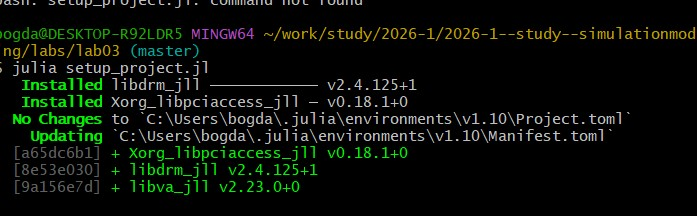{#fig-001 width=70%}

##

Создаю файл, в котором перечисляю все необходимые библиотеки для работы над лабораторной ([рис. @fig-002]).

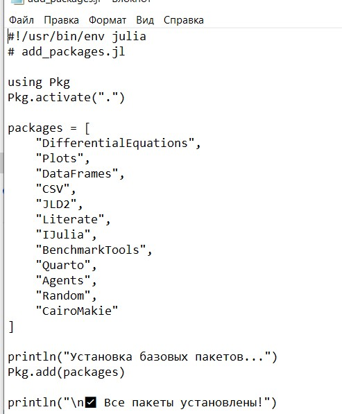{#fig-002 width=70%}

##

Запускаю этот файл ([рис. @fig-003]):

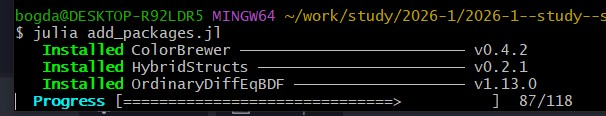{#fig-003 width=70%}

##

Создаём вспомогательный скрипт, где определяется тип агента и функция шага ([рис. @fig-004])

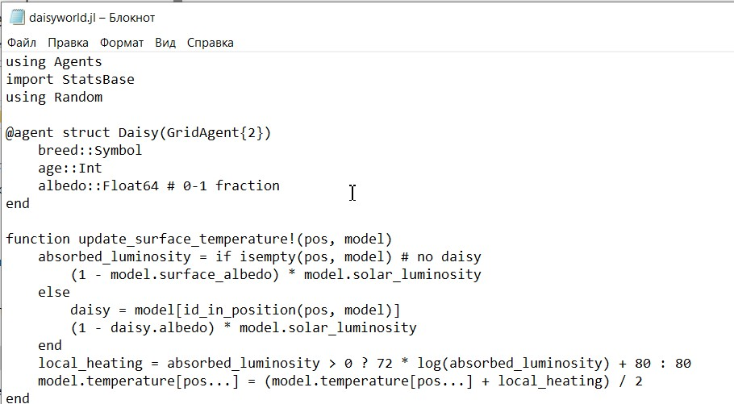{#fig-004 width=70%}

##

Выполняем ([рис. @fig-005])

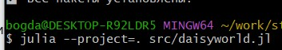{#fig-005 width=70%}

##

Пишем новый скрипт, который создаёт heatmap модели, на которой будут также запечатлены цветы ([рис. @fig-007])

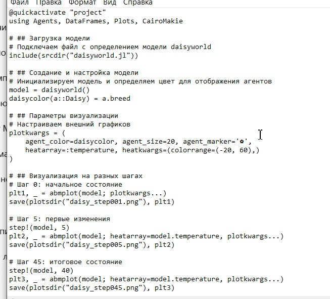{#fig-007 width=70%}

##

Создаём скрипт, сохраняющий анимацию изменения состояния тепловой карты https://rutube.ru/video/private/12525e95cec8c90a7e81866dee9538a7/?p=B_n57KKt1fcDGuS44oZwCQ ([рис. @fig-008])

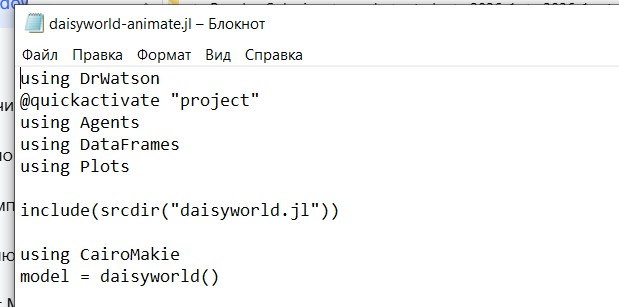{#fig-008 width=70%}

##

Построим график изменения числа маргариток в зависимости от модельного времени ([рис. @fig-009])

{#fig-008 width=70%}

##

Построим комплексный график изменения числа маргариток, температуры, альбедо в зависимости от модельного времени ([рис. @fig-010])

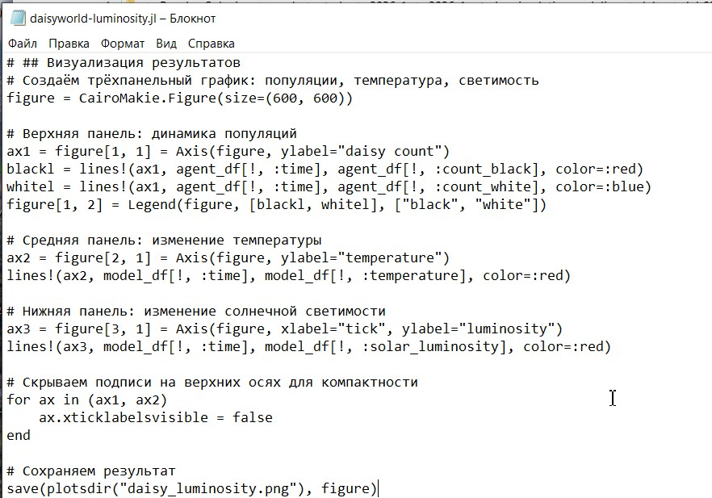{#fig-010 width=70%}

##

Расширим базовую визуализацию за счёт параметров ([рис. @fig-011])

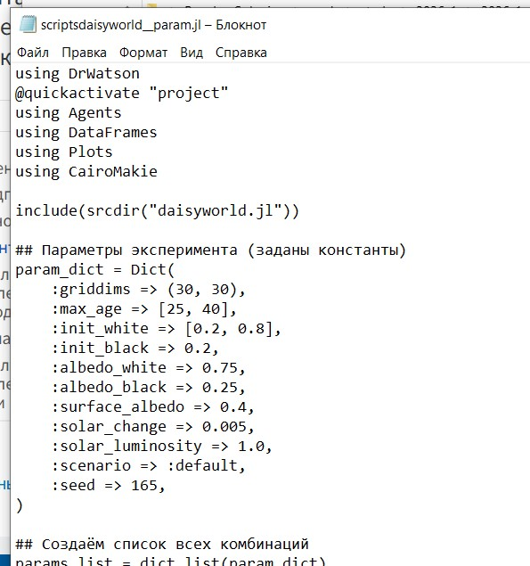{#fig-011 width=70%}

##

Построим график изменения числа маргариток в зависимости от модельного времени с разными параметрами модели. ([рис. @fig-012])

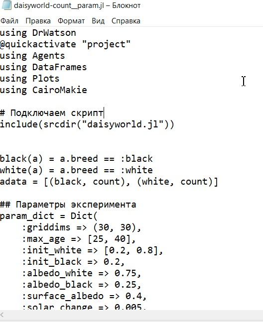{#fig-012 width=70%}

##

Построим комплексный график изменения числа маргариток, температуры, альбедо в зависимости от модельного времени с разными параметрами модели. ([рис. @fig-013])

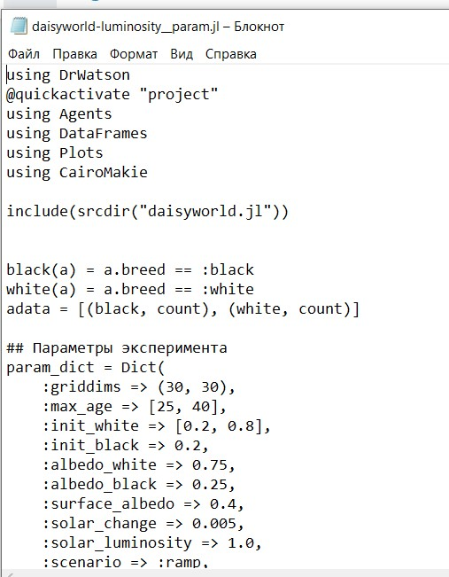{#fig-013 width=70%}

##

Создаю notebook файлы, выполяю такую же команду для всех скриптов ([рис. @fig-013])

{#fig-013 width=70%}

Так же как и нотбук файл от первого скрипта, выполняю все остальные тоже ([рис. @fig-014])

##

# Выводы

Я познакомился с агентной моделью DaisyWorld, научился моделироваить сложную систему, которая меняется под действием сущностей (агентов)

# Список литературы{.unnumbered}

:::
