---
## Author
author:
  name: Соловьев Богдан Михайлович
  degrees: DSc
  orcid: 0000-0002-0877-7063
  email: k
  affiliation:
    - name: Российский университет дружбы народов
      country: Российская Федерация
      postal-code: 117198
      city: Москва
      address: ул. Миклухо-Маклая, д. 6

## Title
title: "Отчёт по лабораторной рабоате 4"
license: "CC BY"
---

```{julia}
using Pkg
Pkg.activate("C:/Users/bogda/work/study/2026-1/2026-1--study--simulationmodeling/labs/lab04/project")
using Agents, DataFrames, Plots, StatsBase
println("Проект активирован: ", Base.active_project())
```
# Цель работы

Создадим агентную модель распространения инфекционного заболевания на основе классической компартментальной модели SIR (Susceptible-Infectious-Recovered).

Модель будет реализована с использованием пакета Agents.jl. 

В отличие от классической модели на дифференциальных уравнениях, агентный подход позволит учесть индивидуальные характеристики, 

пространственную структуру и стохастичность процессов

##

# Задание

Создать рабочий каталог для кода.

Установить необходимые пакеты.

Выполнить предложенный код.

Преобразовать код в литературный стиль.

Сгенерировать из литературного кода:

чистый код;

jupyter notebook;

документацию в формате Quarto.

Выполнить код из jupyter notebook.

Интегрировать документацию в формате Quarto в отчёт.

Добавить в код в литературном стиле вычисление для набора параметров.

Сгенерировать из литературного кода с параметрами:

чистый код;

jupyter notebook;

документацию в формате Quarto.

Выполнить код из jupyter notebook с параметрами.

Интегрировать документацию с параметрами в формате Quarto в отчёт.

##

# Теоретическое введение

Модель SIR, предложенная Кермаком и Маккендриком в 1927 году, описывает динамику эпидемии в популяции, разделённой на три группы:

 (Susceptible) — восприимчивые к заболеванию индивиды;

 (Infectious) — инфицированные, способные заражать восприимчивых;

 (Recovered) — выздоровевшие (или умершие), получившие иммунитет и более не участвующие в распространении.

 ##

 4.1.1.2 Ограничения классического подхода

Несмотря на широкое применение, модель на ОДУ имеет ряд ограничений:

Однородность популяции — все индивиды считаются одинаковыми.

Отсутствие пространственной структуры — предполагается полное перемешивание.

Детерминированность — не учитываются случайные флуктуации.

Непрерывность — количество людей рассматривается как непрерывная величина.

##

4.1.1.3 Преимущества агентного подхода

Агентное моделирование позволяет преодолеть эти ограничения:

Каждый индивид моделируется отдельно с уникальными характеристиками.

Взаимодействия происходят локально в пространстве или социальной сети.

Процессы носят стохастический характер.

Можно учитывать гетерогенность контактов, мобильность, меры контроля.

##

Ns — вектор численности населения по локациям;

β_und — вероятность передачи для невыявленных случаев;

β_det — вероятность передачи для выявленных случаев;

infection_period — длительность заболевания (дней);

detection_time — время до выявления заболевания;

death_rate — вероятность летального исхода;

reinfection_probability — вероятность повторного заражения;

migration_rates — матрица вероятностей миграции между локациями.

##

# Выполнение лабораторной работы

Создаю пространство для выполнения лабораторной. Для этого создаю setup_report, потом add_packages и tangle. (Ничего нового)

##

Создаю фалй sir_model в папке src ([рис. @fig-001]).

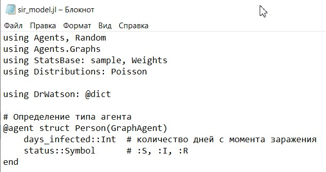{#fig-001 width=70%}

##

Создаю скрипт sir_run_basic и запускаю его. Пик эпидемии где-то на 18 день([рис. @fig-002]).

{#fig-002 width=70%}

##

Создаю скрипт sir_scan_beta. При beta >= 0.4 все инфицируются ([рис. @fig-003]).

{#fig-003 width=70%}

##

Создаём скрипт sir_migration_effect, на котором видно, что при интенсивности миграции 0.1 все инфицируются ([рис. @fig-020])

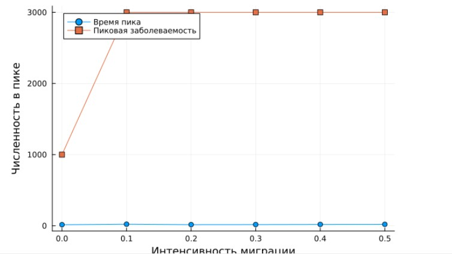{#fig-020 width=70%}

##

Создаю скрипт sir_optimize_parameters. Получаю оптимальные параметры ([рис. @fig-004])

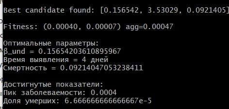{#fig-004 width=70%}\

##

И графики ([рис. @fig-021])

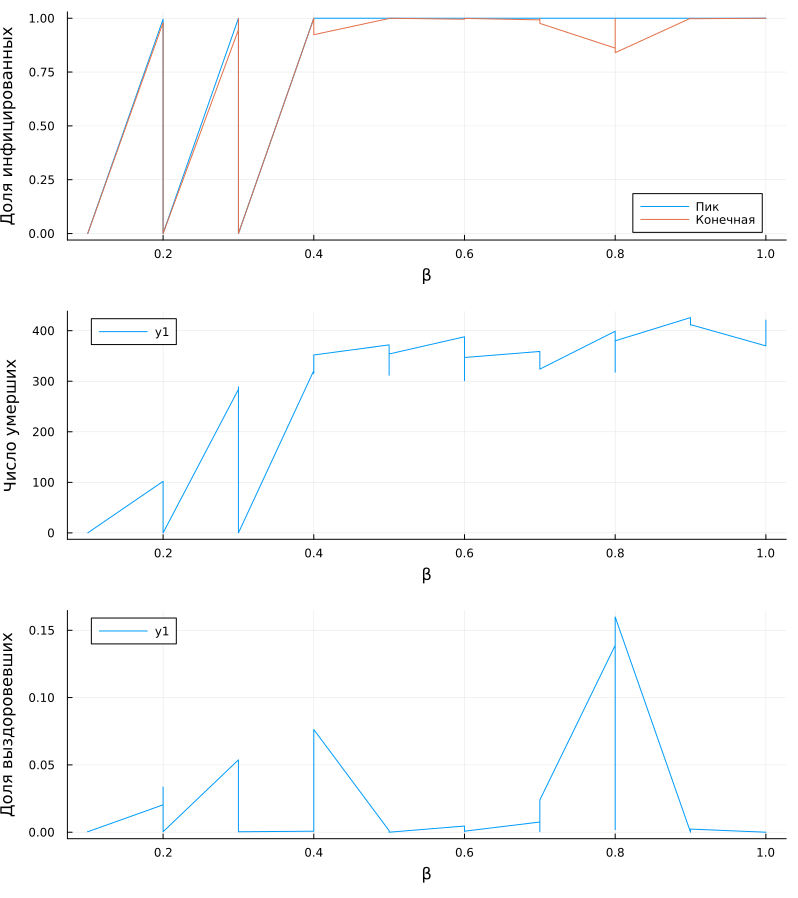{#fig-021 width=70%}

##

# дополнительное задание

Считаю параметры. Определяю базовое репродуктивное число R₀ по формуле R₀ = β/γ, где γ = 1/infection_period. ([рис. @fig-006])

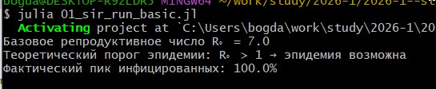{#fig-006 width=70%}

##

Счтаю beta. Нахожу минимальное значение, при котором возникает эпидемия (пик % популяции). График ([рис. @fig-007])

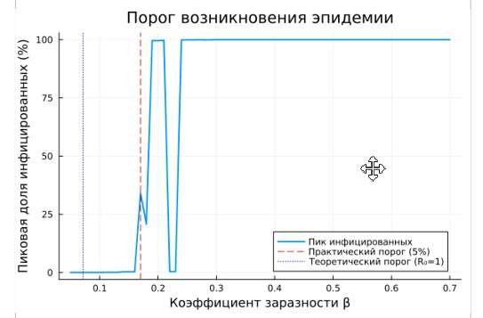{#fig-007 width=70%}

##

Занчение ([рис. @fig-008])

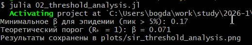{#fig-008 width=70%}

##

Задайте разные значения beta для разных городов([рис. @fig-009])

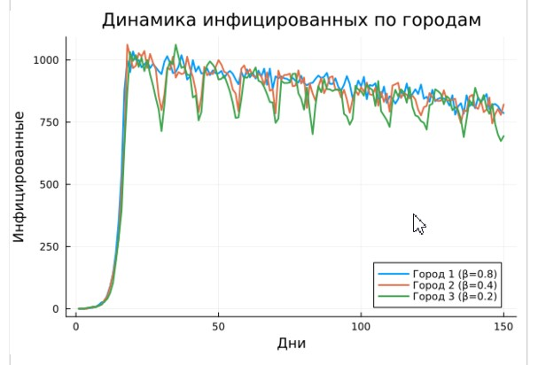{#fig-009 width=70%}

##

Исследую влияние интенсивности миграции на скорость распространения инфекции из одного города в другие. ([рис. @fig-010])

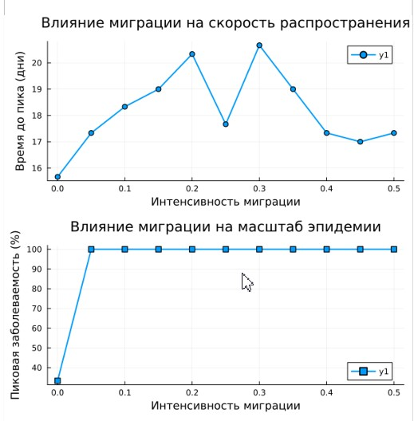{#fig-010 width=70%}

##

Минимальное времядо пика ([рис. @fig-011])

{#fig-011 width=70%}

##

Модифицирую модель, добавив возможность закрытия города (обнуление миграции из него) при превышении порога заболеваемости. 
Эффективность получается не высокой. ([рис. @fig-012])

##

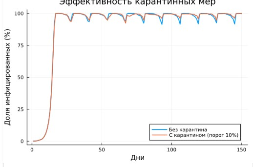{#fig-012 width=70%}

Считаем оптимальные параметры ([рис. @fig-013])

##

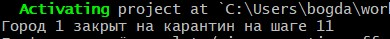{#fig-013 width=70%}

# Выводы

Я улучшил модель SIR с помощью агентного полдхода

# Список литературы{.unnumbered}

::: {#refs}
:::
