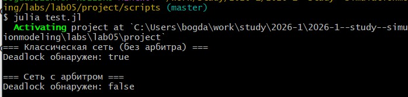
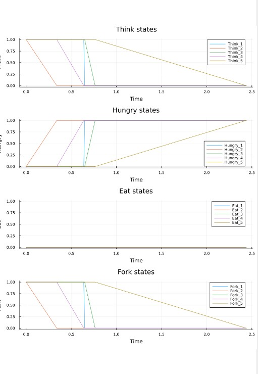
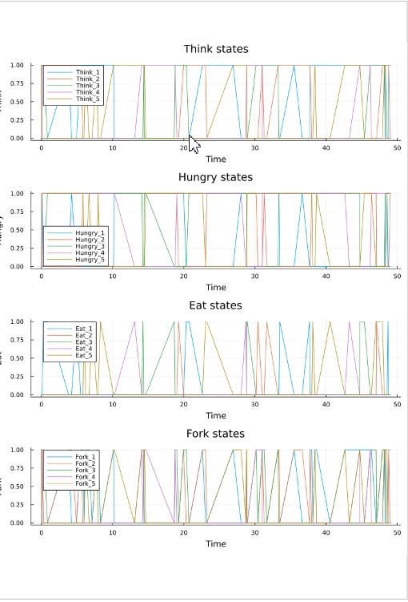
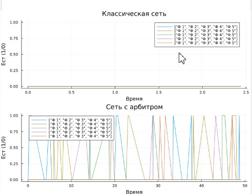

---
## Author
author:
  name: Соловьев Богдан Михайлович
  affiliation:
    - name: Российский университет дружбы народов
      country: Российская Федерация
      postal-code: 117198
      city: Москва
      address: ул. Миклухо-Маклая, д. 6
## Title
title: Презентация лаборотарной работы 5
license: CC BY
date: today
date-format: "YYYY-MM-DD" # Example: 2025-09-06
---

# Информация

:::
::::::::::::::

# Цель работы

Построить сеть Петри для пяти философов, моделируя захват и освобождение вилок.

Обнаружить состояние взаимной блокировки (deadlock), когда каждый философ взял одну вилку и ждёт вторую.

Провести имитационное моделирование (стохастическое и детерминированное) и выявить наличие deadlock.

Модифицировать сеть, чтобы предотвратить deadlock.

Проанализировать результаты и оформить отчёт с графиками и анимацией.

---

# Задание

Создать рабочий каталог для кода.

Установить необходимые пакеты.

Выполнить предложенный код.

Преобразовать код в литературный стиль.

Сгенерировать из литературного кода:

чистый код;

jupyter notebook;

документацию в формате Quarto.

Выполнить код из jupyter notebook.

Интегрировать документацию в формате Quarto в отчёт.

Добавить в код в литературном стиле вычисление для набора параметров.

Сгенерировать из литературного кода с параметрами:

чистый код;

jupyter notebook;

документацию в формате Quarto.

Выполнить код из jupyter notebook с параметрами.

Интегрировать документацию с параметрами в формате Quarto в отчёт.

---

# Теоретическое введение

Сеть Петри есть математический аппарат для моделирования дискретных систем. Графически она представляется как двудольный ориентированный граф двух типов вершин: позиции (круги) и переходы (прямоугольники).

Позиции (Places) суть пассивные элементы, описывающие состояние системы (например, наличие ресурса или выполнение условия).

Внутри позиции могут находиться фишки (tokens) — неотрицательное целое число, указывающее на количество ресурсов.

Переходы (Transitions) суть активные элементы, описывающие события или действия системы.

Они могут срабатывать, изменяя состояние модели.

Дуги (Arcs) суть направленные соединения между позициями и переходами (но не между двумя позициями или двумя переходами), 

которые показывают, как состояние влияет на события и наоборот.

Маркировка (Marking) есть распределение фишек по позициям в определённый момент времени, то есть текущее состояние модели.

Смена маркировок происходит при срабатывании переходов в соответствии с определёнными правилами.

Теория сетей Петри, появившаяся как инструмент для анализа химических процессов, сегодня является мощным и наглядным математическим аппаратом.

 Она незаменима везде, где нужно описать параллельные, асинхронные и распределённые системы. В её основе лежат всего четыре элемента, а богатство поведения возникает из их комбинации.

---

# Выполнение лабораторной работы

Создаю пространство для выполнения лабораторной. Для этого создаю setup_report, потом add_packages и tangle. (Ничего нового), 

поэтому перейдём сразу к модели. Создаю в папке src саму модель, которой буду пользоваться дальше. Теперь запускаю код, который

Создаёт классическую сеть Петри для N=5 философов с помощью build_classical_network.

и запускапет симуляцию (алгоритм Гиллеспи) на время tmax = 50.0.

Анализирует последнее состояние на предмет deadlock с помощью detect_deadlock и выводит результат в консоль.

есть ли дедлок([рис. @fig-001]).

{#fig-001 width=70%}

---

Так же этот скрипт выводит графики обычной модели ([рис. @fig-002]).

{#fig-002 width=70%}

---

и модели с арбитром ([рис. @fig-003]).

{#fig-003 width=70%}

---

Сравнение графиков ([рис. @fig-004])

{#fig-004 width=70%}

---

# Выводы

Я построил сеть Петри для пяти философов и модифицировал цеть с помощью арбитра, чтобы предотвратить deadlock

# Список литературы{.unnumbered}

::: {#refs}
:::

