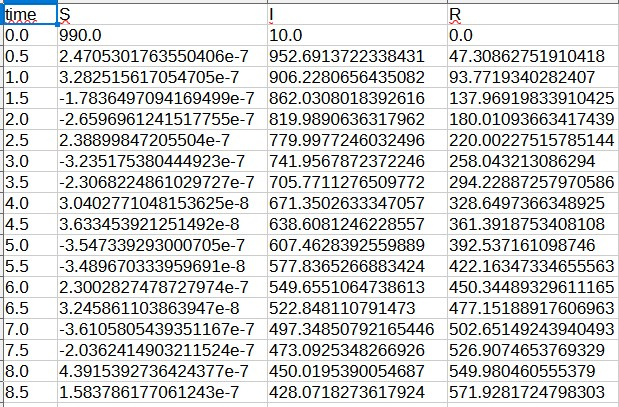

---
## Author
author:
  name: Соловьев Богдан Михайлович
  degrees: student
  email: k
  affiliation:
    - name: Российский университет дружбы народов
      country: Российская Федерация
      postal-code: 117198
      city: Москва
      address: ул. Миклухо-Маклая, д. 6

## Title
title: "Отчёт по лабораторной рабоате 6"
license: "CC BY"
---

```{julia}
using Pkg
Pkg.activate("C:/Users/bogda/work/study/2026-1/2026-1--study--simulationmodeling/labs/lab06/project")
using Agents, DataFrames, Plots, StatsBase
println("Проект активирован: ", Base.active_project())
```
# Цель работы

Реализовать модель эпидемии SIR (Susceptible–Infectious–Recovered) с использованием сетей Петри.

# Задание

Создать рабочий каталог для кода.

Установить необходимые пакеты.

Выполнить предложенный код.

Преобразовать код в литературный стиль.

Сгенерировать из литературного кода:

чистый код;

jupyter notebook;

документацию в формате Quarto.

Выполнить код из jupyter notebook.

Интегрировать документацию в формате Quarto в отчёт.

Добавить в код в литературном стиле вычисление для набора параметров.

Сгенерировать из литературного кода с параметрами:

чистый код;

jupyter notebook;

документацию в формате Quarto.

Выполнить код из jupyter notebook с параметрами.

Интегрировать документацию с параметрами в формате Quarto в отчёт.

# Теоретическое введение

Модель описывает переходы между тремя состояниями:

 S (восприимчивые) — могут заразиться;

 I (инфицированные) — заражают других и выздоравливают;

 R (выздоровевшие / с иммунитетом) — больше не участвуют в эпидемии.

Сеть Петри содержит два перехода:

infection: 

 (скорость β);

recovery: 

 (скорость γ).

# Выполнение лабораторной работы

Создаю пространство для выполнения лабораторной. Для этого создаю setup_report, потом add_packages и tangle. (Ничего нового), 

поэтому перейдём сразу к модели. Создаю в папке src саму модель, которой буду пользоваться дальше. Теперь запускаю код, который

выполоняет базовый прогон модели с b=0,3 y=0,1. При этом запускается две симуляции:

детерминированную (решение ОДУ) — даёт плавную усреднённую динамику;

стохастическую (алгоритм Гиллеспи) — учитывает случайные флуктуации.

Сохраняет результаты в CSV‑файлы и строит графики S(t), I(t), R(t) есть ли дедлок([рис. @fig-001]).

{#fig-001 width=70%}

Так же этот скрипт выводит графики S(t)m I(t), R(t) ([рис. @fig-002]).

{#fig-002 width=70%}

Детерминированный график показывает классический пик эпидемии: рост I, максимум, затем спад до нуля; R растёт и выходит на плато, S падает.

Стохастический график может иметь шумы и, возможно, немного отличаться по времени пика и амплитуде – это демонстрирует влияние случайности. ([рис. @fig-003]).

{#fig-003 width=70%}



Далее запускается исследование чувствительности системы к параметру b

β_range = 0.1 : 0.05 : 0.8 (всего 15 значений)

γ_fixed = 0.1

tmax = 100.0

Такой график демонстрирует пороговое явление, характерное для модели SIR: существует критическое значение β, выше которого возникает вспышка.

 ([рис. @fig-004])

{#fig-004 width=70%}



Сравнение детерминированной и стохастической кривых I(t) показывает, насколько велик разброс, вызванный случайностью. При большом размере популяции они близки.

График чувствительности позволяет количественно оценить, как изменение заразности β влияет на тяжесть эпидемии (пик I). Это важно для принятия решений (например, меры по снижению β).

{#fig-005 width=70%}

{#fig-006 width=70%}

# Выводы

Я реализовал модели эпидемии SIR


# Список литературы{.unnumbered}

::: {#refs}
:::
