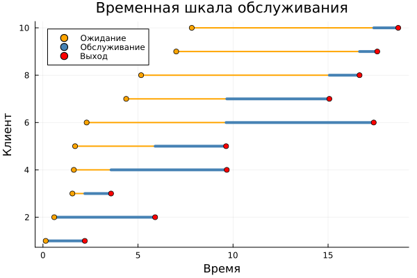
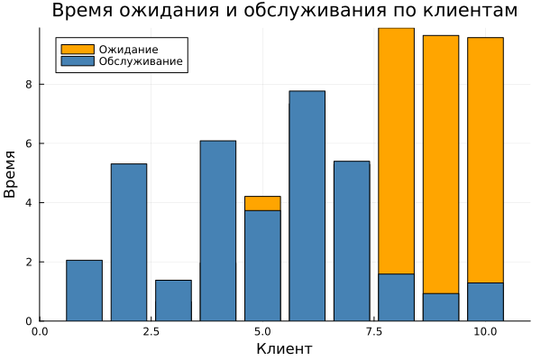
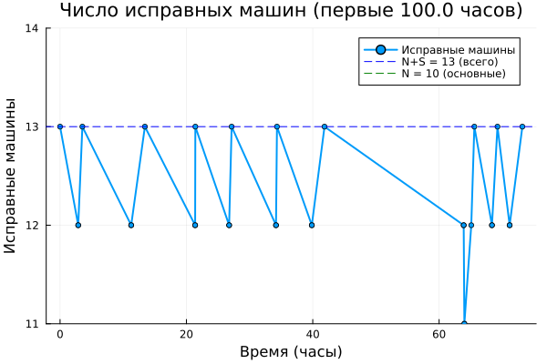
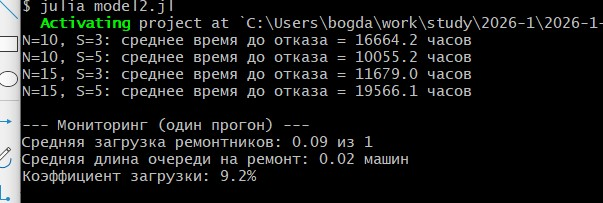
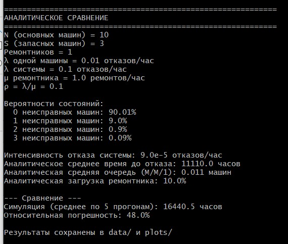

---
## Author
author:
  name: Соловьев Богдан Михайлович
  affiliation:
    - name: Российский университет дружбы народов
      country: Российская Федерация
      postal-code: 117198
      city: Москва
      address: ул. Миклухо-Маклая, д. 6
## Title
title: Презентация лаборотарной работы 6
license: CC BY
date: today
date-format: "YYYY-MM-DD" # Example: 2025-09-06
---

# Информация

:::
::::::::::::::

---

# Цель работы

Рассмотреть модель M/M/c (по классификации Кендалла) — это система массового обслуживания со следующими свойствами

и модель модель Росса, которая представляет собой классический пример системы массового обслуживания с конечной популяцией, резервом и ремонтом.

---

# Задание

Создать рабочий каталог для кода.

Установить необходимые пакеты.

Выполнить предложенный код.

Преобразовать код в литературный стиль.

Сгенерировать из литературного кода:

чистый код;

jupyter notebook;

документацию в формате Quarto.

Выполнить код из jupyter notebook.

Интегрировать документацию в формате Quarto в отчёт.

Добавить в код в литературном стиле вычисление для набора параметров.

Сгенерировать из литературного кода с параметрами:

чистый код;

jupyter notebook;

документацию в формате Quarto.

Выполнить код из jupyter notebook с параметрами.

Интегрировать документацию с параметрами в формате Quarto в отчёт.

---

# Выполнение лабораторной работы

Создаю пространство для выполнения лабораторной. Для этого создаю setup_report, потом add_packages и tangle. (Ничего нового), 

поэтому перейдём сразу к модели. Я добавил дополнительное логирование (хотя это было не обязательно),

так как я сделал создане графиков в этом же файле model1.

---

Первый график показывает сколько времени было потрачено на осблуживание всех клиентов ([рис. @fig-001])

{#fig-001 width=70%}

---

Второй график показывает сколько времени для каждого клиента было затрачено на обслуживание и ожидание ([рис. @fig-002]).

{#fig-002 width=70%}

---

Теперь переходим к модели Росса, где нужно было добавить нескольких ремонтников, сделайте прогон для разного количества машин,

так же провести мониторинг загрузки ремонтника, средней длины очереди на ремонт.

---

Здесь прелставлен график исправных машин во времени, но были взяты только первые 100 часов, чтобы график был читаемым ([рис. @fig-003]).

{#fig-003 width=70%}

---

Далее показан вывод среднего времени до отказа и мониторинга

{#fig-003 width=70%}

---

И аналитическое сравнение с результатами эксперимента([рис. @fig-004]).

(N=10, S=3, λ=100, μ=1)

$$\lambda_{sys} = \frac{10}{100} = 0.1 \text{ отказов/час}$$
$$\mu = 1 \text{ ремонт/час}$$
$$\rho = \frac{0.1}{1} = 0.1$$

**Стационарные вероятности:**
$$\pi_0 = \frac{1}{1 + 0.1 + 0.01 + 0.001} = \frac{1}{1.111} = 0.9001$$
$$\pi_1 = 0.0900$$
$$\pi_2 = 0.0090$$
$$\pi_3 = 0.0009$$

---

**Среднее время до отказа:**
$$\lambda_{отказа} = 0.1 \cdot 0.0009 = 0.00009 \text{ отказов/час}$$
$$T_{отказа} = \frac{1}{0.00009} \approx 11110 \text{ часов}$$

---

{#fig-005 width=70%}

---

# Выводы

Я реализовал модели 
