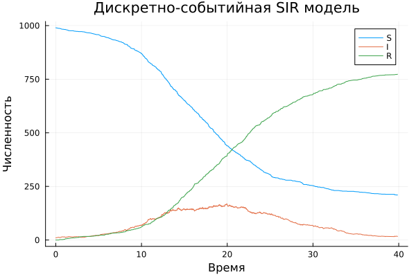

---
## Author
author:
  name: Соловьев Богдан Михайлович
  affiliation:
    - name: Российский университет дружбы народов
      country: Российская Федерация
      postal-code: 117198
      city: Москва
      address: ул. Миклухо-Маклая, д. 6
## Title
title: Презентация лаборотарной работы 6
license: CC BY
date: today
date-format: "YYYY-MM-DD" # Example: 2025-09-06
---

# Информация

:::
::::::::::::::

---

# Цель работы

Изучить дискретно-событийный подход к имитационному моделированию на примере классической модели распространения инфекции SIR. 
 
Реализовать стохастическую дискретно-событийную модель в виде программного комплекса на языке Julia. 

Провести анализ влияния параметров, сравнить со стохастической и детерминированной версиями, оценить производительность и модифицировать модель.

---

# Задание

Создать рабочий каталог для кода.

Установить необходимые пакеты.

Выполнить предложенный код.

Преобразовать код в литературный стиль.

Сгенерировать из литературного кода:

чистый код;

jupyter notebook;

документацию в формате Quarto.

Выполнить код из jupyter notebook.

Интегрировать документацию в формате Quarto в отчёт.

Добавить в код в литературном стиле вычисление для набора параметров.

Сгенерировать из литературного кода с параметрами:

чистый код;

jupyter notebook;

документацию в формате Quarto.

Выполнить код из jupyter notebook с параметрами.

Интегрировать документацию с параметрами в формате Quarto в отчёт.

---

# Выполнение лабораторной работы

Программа реализует стохастическую SIR-модель на основе дискретных агентов (индивидов) 

с использованием библиотеки ConcurrentSim для событийно-ориентированного моделирования.

Вспомогательные функции мутации массивов статистики

 `increment!(a)` — добавляет в конец массива значение на 1 больше последнего.

 `decrement!(a)` — добавляет значение на 1 меньше последнего.

 `carryover!(a)` — дублирует последнее значение.

---

Используются для фиксации изменений численности восприимчивых (`Sa`), инфицированных (`Ia`) и выздоровевших (`Ra`) в момент событий.

Структуры данных

 **`SIRPerson`** — агент с полями `id` (уникальный идентификатор) и `status` (состояние `:S`, `:I`, `:R`).

 **`SIRModel`** — контейнер состояния модели: объект симуляции, параметры (`β`, `c`, `γ`), временные ряды (`ta`, `Sa`, `Ia`, `Ra`) и список всех агентов.

---

Функции обновления статистики

 `infection_update!()` — фиксирует заражение: добавляет текущее время, уменьшает `S`, увеличивает `I`, `R` без изменений.

 `recovery_update!()` — фиксирует выздоровление: добавляет время, `S` без изменений, уменьшает `I`, увеличивает `R`.

Основной процесс агента (`live`)

---

Функция с макросом `@resumable` описывает жизненный цикл индивида:

1. **Восприимчивый (`:S`)** — ждёт случайное время (экспоненциальное с параметром `1/c`), 

случайно выбирает другого индивида; если тот инфицирован — с вероятностью `β` заражается.

2. **Инфицированный (`:I`)** — ждёт случайное время выздоровления (экспоненциальное с параметром `1/γ`) и переходит в состояние `:R`.

---

Функции управления моделью

 **`MakeSIRModel(u0, p)`** — создаёт модель с начальными условиями `[S0, I0, R0]` и параметрами `[β, c, γ]`.

 **`activate(m)`** — регистрирует процессы всех агентов в симуляции.

 **`sir_run(m, tf)`** — запускает симуляцию до момента времени `tf`.

 **`out(m)`** — возвращает результаты в виде `DataFrame` с колонками `t`, `S`, `I`, `R`.

---

В скрипте запуска есть следующие входные данные:

tmax = 40.0 — длительность симуляции.

u0 = [990, 10, 0] — начальные количества S, I, R.

p = [0.05, 10.0, 0.25] — β, c, γ.

---

Здесь показан получившийся график ([рис. @fig-001])

{#fig-001 width=70%}

---

Программа моделирует стохастическое распространение инфекции в полностью перемешанной популяции конечного размера.

 В отличие от детерминированной модели (системы ОДУ), здесь наблюдаются случайные флуктуации и возможны ранние вымирания инфекции при малом начальном числе заражённых.

**1. Инициализация** — создаются объекты-агенты (`SIRPerson`) с начальными статусами (`:S`, `:I`, `:R`), инициализируются массивы статистики (`ta`, `Sa`, `Ia`, `Ra`).

**2. Планирование процессов** — для каждого агента создаётся параллельный процесс (`@process`), реализующий его жизненный цикл (функция `live`).

---

**3. Запуск симуляции** — `ConcurrentSim.run` продвигает виртуальное время, обрабатывая события в хронологическом порядке. Каждый `@yield timeout` добавляет событие в календарь; при наступлении события выполняется соответствующий код в `live` (возможно, порождая новые события).

**4. Сбор статистики** — в момент изменения статуса агента обновляются временные ряды (`Sa`, `Ia`, `Ra`) и фиксируется текущее время в `ta`.

**5. Завершение** — по достижении конечного времени `tf` симуляция останавливается; накопленные ряды экспортируются в `DataFrame`.

**6. Постобработка** — построение графиков динамики эпидемии, сохранение результатов, анализ вымираний.

---

# Выводы

Я изучил дискретно-событийный подход у имитационному моделированию на примере классической модели SIR
